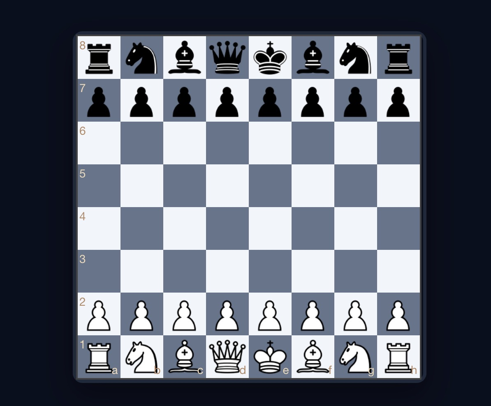

#MasterChess

MasterChess è un gioco di scacchi moderno e minimalista giocabile direttamente dal browser. Sfida un amico online tramite codice partita oppure affronta una semplice IA in modalità giocatore singolo.

Il gioco include:
-  Modalità singleplayer contro IA
-  Multiplayer online P2P tramite codice stanza
-  Scacchiera responsive ottimizzata desktop e mobile
-  Sistema vittorie e sconfitte salvato localmente
-  Evidenziazione mosse e pezzi catturati
-  Supporto fullscreen e wake lock mobile

È collegato alla repository centrale MasterHub (https://mastersabba.github.io/MasterSabba/), piena di altri minigame.
